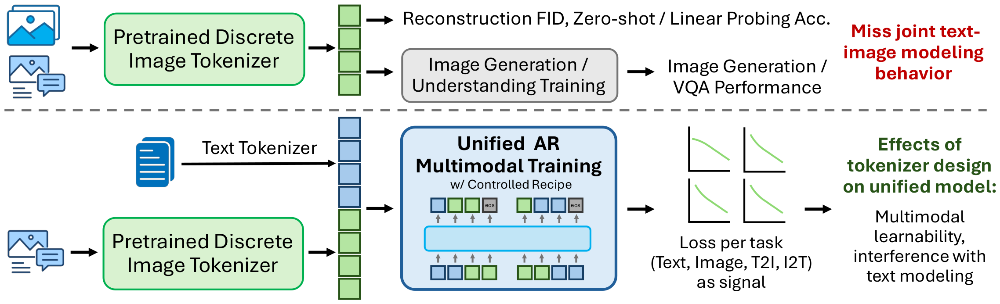

<div align="center">
<h1>Studying Image Tokenizers as Visual Languages<br>in Unified Multimodal Models</h1>

Official implementation and evaluation code.
</div>

<p align="center">
  
</p>
<p align="center">
<em>Image tokenizers do more than reconstruct pixels: they define the visual
language that a unified model must learn, align with text, and use for both
generation and understanding. Prior tokenizer studies rely on
downstream-agnostic metrics (reconstruction / probing) or single-axis
generation- or understanding-only pipelines, which miss joint text&ndash;image
modeling behavior. We study tokenizers in the context of unified AR multimodal
training, using task-specific losses as a signal to reveal how the tokenizer
shapes downstream joint modeling.</em>
</p>

## TL;DR

Image tokenizers define the **visual language** of unified multimodal models,
yet are commonly studied through isolated metrics (reconstruction quality,
probing) or generation-/understanding-only evaluations. Such views do not fully
capture how visual tokens behave when they are modeled *jointly* with text,
under a shared model and training objective.

We build a controlled **pure-autoregressive (AR) unified multimodal testbed**
and characterize joint modeling through **task-specific pretraining losses**
over **text**, **unconditional image**, **text-to-image (T2I)**, and
**image-to-text (I2T)** prediction. We first establish how these losses scale
and how they relate to downstream performance, and then use them as a lens for
probing **multimodal learnability** — how well image and text tokens are jointly
modeled — and for revisiting tokenizer design. Our findings suggest that unified
tokenizer design should account for both reconstruction fidelity and joint
modeling difficulty across tasks, rather than optimizing any single proxy
metric.

## 🔑 Main Findings

### Interpreting loss in unified multimodal training

- **Loss should be analyzed per task.** Text, image, T2I, and I2T losses all
  scale smoothly with data and model size, but exhibit distinct scaling
  behavior that an averaged loss obscures, and no single tokenizer ranking
  holds across tasks. Text loss is largely inherited from the text-only model
  we initialize from, while the image-side losses are shaped by multimodal
  continual pretraining; T2I loss closely tracks the unconditional image loss,
  whereas I2T loss carries a distinct cross-modal signal.

- **Token space shapes the loss–performance relationship.** For a fixed
  tokenizer, both T2I and I2T losses align with generation quality. Across
  tokenizers, I2T loss — computed over a shared text vocabulary — provides a
  more consistent signal of generation performance, whereas T2I loss exhibits
  tokenizer-dependent shifts. Vocabulary normalization reduces these shifts
  within the IBQ family, while residual differences at a fixed vocabulary size
  are associated with reconstruction fidelity.

- **Pretraining losses remain informative after SFT.** I2T loss correlates
  with both generation and general visual understanding (VQAv2, GQA) across
  tokenizers, while the relationship between T2I loss and generation
  performance is tokenizer-dependent. The relationship is less consistent for
  specialized benchmarks such as TextVQA, which additionally require
  capabilities such as OCR.

### What unified training reveals about image tokenizers

- **Reconstruction fidelity and multimodal learnability can diverge.** We
  measure fidelity by rFID and take *multimodal learnability* to be how well
  the resulting image and text tokens are modeled under the shared AR
  objective, as reflected by the task-specific validation losses. Lower rFID
  does not promise stronger downstream generation or understanding; the two
  jointly affect performance, so tokenizer selection should account for both.

- **The image token space can affect text modeling.** Even with the language
  backbone, text tokenizer, and text data fixed, changing the image tokenizer
  changes text loss. Ablating the image-token prediction objective (training on
  Text+I2T only) largely removes this gap, attributing the effect to image-token
  prediction rather than to captioning (I2T) — while the I2T gap itself
  persists, a cross-modal effect invisible to single-axis evaluation.

### Revisiting tokenizer design choices

- **Discriminator:** replacing PatchGAN with a DINO-based discriminator improves
  GigaTok's rFID (0.81 → 0.51), but does not improve multimodal learnability or
  downstream performance — GenAI-Bench is unchanged and VQAv2 even drops
  (52.25 → 51.31).

- **Semantic supervision:** UniTok-sem degrades reconstruction yet improves
  every validation loss and downstream metric. The gain comes from
  strengthening object-level image-token–word associations ("better visual
  words") — concentrated on COCO object words and reflected in higher PMI —
  without consistently reducing the empirical *n*-gram entropy of the image
  tokens, so the measurements give no clear evidence for a simpler local
  visual grammar.

- **Vocabulary size:** its effect on multimodal learnability is non-monotonic.
  Among the IBQ variants, IBQ-16384 attains the best I2T loss while the
  intermediate IBQ-8192 achieves the lowest vocabulary-normalized T2I and image
  losses; IBQ-16384 nevertheless performs best downstream, potentially through
  its higher reconstruction fidelity.

## 🧩 What's in this repo

- **Unified AR training** (`liquid/`, `scripts/`): a controlled pure-AR
  continual-pretraining + SFT recipe using [Qwen3](https://github.com/QwenLM/Qwen3)
  dense models (0.6B / 1.7B / 4B) as the language-model backbone, with the
  vocabulary and LM head extended to model flattened discrete image tokens.
- **Image tokenizers** (`evaluation/`): integrations for the tokenizers studied
  in the paper (see below and [evaluation/TOKENIZERS.md](evaluation/TOKENIZERS.md)).
- **Data processing** (`data_process/`): tokenization / conversion of the
  mixed-modal pretraining and SFT data.
- **Analysis & evaluation** (`evaluation/`): task-specific validation-loss
  computation, and T2I (GenAI-Bench, MJHQ-30K, DPG, WISE) and VQA
  (VQAv2, GQA, TextVQA, POPE, ...) evaluation.

## 🔬 Tokenizers studied

| Tokenizer | Variants | Directory |
|-----------|----------|-----------|
| IBQ (SEED-Voken) | vocab 1024 / 8192 / 16384 | `evaluation/seed_voken/` |
| GigaTok | PatchGAN and DINO discriminator | `evaluation/GigaTok/` |
| UniTok | with / without semantic supervision | `evaluation/unitok/` |
| Chameleon VQGAN | recipe sanity-check (Qwen3-8B) | `evaluation/chameleon/` |

Third-party tokenizer code is adapted from the respective upstream projects and
retains their licenses; see [evaluation/TOKENIZERS.md](evaluation/TOKENIZERS.md).

## ⚙️ Installation

Build the training / evaluation conda environments with:

```bash
bash scripts/setup_env.sh && conda activate liquid
```

This builds `liquid` (training, data tokenization for every image tokenizer, and
most evaluation) plus `t2v` and `base` for GenAI-Bench and WISE scoring.
Inference and evaluation mainly require the `transformers` library plus a few
basic components — but **`transformers>=4.51.0` is required**, since Qwen3
support first shipped in that release. See
[evaluation/EVAL.md](evaluation/EVAL.md) and
[TRAIN.md](TRAIN.md#environment) for the full environment.

### Path configuration

The training / evaluation / data-processing scripts read all machine-specific
paths from environment variables so that no absolute paths are hard-coded.
Copy the template and edit it for your environment:

```bash
cp .env.example .env
# then edit .env
```

| Variable     | Meaning                                              |
|--------------|------------------------------------------------------|
| `REPO_ROOT`  | Path to this repository (used for writing outputs).  |
| `DATA_ROOT`  | Root holding datasets / tokenized data / benchmarks. |
| `CKPT_ROOT`  | Root holding model checkpoints.                      |
| `HF_CACHE`   | HuggingFace datasets cache directory.                |
| `CONDA_ROOT` | Conda installation root (used by some eval scripts). |

Shell scripts source `.env` automatically; Python scripts read the same
variables via `os.environ` (falling back to `/path/to/...` placeholders if
unset). `.env` is git-ignored.

### Tokenizer weights

No model weights are shipped in this repository. Download the weights for each
tokenizer from its upstream project and place them at the expected paths — see
[evaluation/TOKENIZERS.md](evaluation/TOKENIZERS.md).

## 📦 Data & Training

See [Data.md](./Data.md) for data processing and [TRAIN.md](./TRAIN.md) for the
continual-pretraining and supervised-finetuning recipe. All images used in
training are publicly accessible.

## 📊 Evaluation

See [evaluation/EVAL.md](evaluation/EVAL.md) for text-to-image and visual
understanding evaluation, and the task-specific validation-loss scripts under
`evaluation/`.

### Inference

```bash
cd evaluation

# text dialogue
python inference_t2t.py --model_path /path/to/checkpoint --prompt "Write me a poem about Machine Learning."

# image understanding
python inference_i2t.py --model_path /path/to/checkpoint --image_path samples/baklava.png --prompt "How to make this pastry?"

# image generation
python inference_t2i.py --model_path /path/to/checkpoint --prompt "young blue dragon with horn lightning in the style of dd fantasy full body"
```

## 🙏 Acknowledgements

This repository is developed primarily on top of
[FoundationVision/Liquid](https://github.com/FoundationVision/Liquid). We
thank the Liquid authors for open-sourcing their unified autoregressive
training, data-processing, and evaluation framework.

The tokenizer integrations are adapted from the following open-source
projects:

- [TencentARC/SEED-Voken](https://github.com/TencentARC/SEED-Voken) for the
  IBQ tokenizers;
- [SilentView/GigaTok](https://github.com/SilentView/GigaTok) for GigaTok and
  GigaTok-DINO;
- [FoundationVision/UniTok](https://github.com/FoundationVision/UniTok) for
  UniTok and UniTok-sem; and
- [facebookresearch/chameleon](https://github.com/facebookresearch/chameleon)
  for the Chameleon tokenizer used in the recipe sanity check.

We thank the authors of these projects for making their code and models
available. Please refer to the respective upstream repositories and
[evaluation/TOKENIZERS.md](evaluation/TOKENIZERS.md) for their licenses and
usage terms.

## 📄 License

The code in this repository is released under the Apache License 2.0 (see
[LICENSE](LICENSE)). Third-party code vendored under `evaluation/` and
`data_process/vqgan/` is **excluded from that grant** and remains subject to the
licenses of the respective upstream projects; see
[evaluation/TOKENIZERS.md](evaluation/TOKENIZERS.md).

In particular, the Chameleon code in
[`evaluation/chameleon/`](evaluation/chameleon/) and the Chameleon VQGAN
tokenizer in [`data_process/vqgan/`](data_process/vqgan/) are covered by the
[Chameleon Research License](evaluation/chameleon/LICENSE), which permits
**noncommercial research use only** and incorporates Meta's
[Chameleon Acceptable Use Policy](https://ai.meta.com/resources/models-and-libraries/chameleon-use-policy/).
Each of those directories carries its own `LICENSE` and `NOTICE`.

## Citation

Paper: [arXiv:2609.09143](https://arxiv.org/abs/2609.09143)

```bibtex
@misc{tokenizer-umm,
  title         = {Studying Image Tokenizers as Visual Languages in Unified Multimodal Models},
  author        = {Siting Li and Zhengyang Wang and Simon Shaolei Du and Xi Chen and Yang Liu},
  year          = {2026},
  eprint        = {2609.09143},
  archivePrefix = {arXiv},
  primaryClass  = {cs.CV},
  url           = {https://arxiv.org/abs/2609.09143}
}
```
